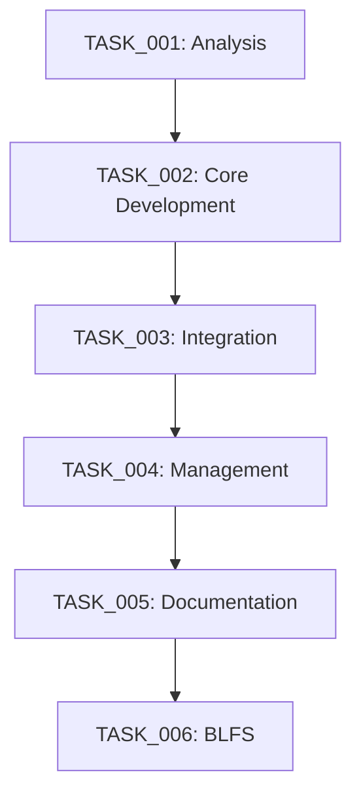

# LFS Build Wrapper System - Task Summary

## Project Overview
- **Project:** LFS/BLFS Build Scripts Wrapper System
- **Start Date:** 2025-05-31
- **Target Completion:** 2025-06-16
- **Status:** IN PROGRESS
- **Current Phase:** Analysis and Planning

## Task Status Overview

### Task Completion Matrix
| Task ID | Description | Status | Dependencies | Start Date | Due Date | Progress |
|---------|-------------|--------|--------------|------------|----------|-----------|
| TASK_001 | Analysis and Planning | IN PROGRESS | None | 2025-05-31 | 2025-06-02 | 80% |
| TASK_002 | Core Wrapper Development | PENDING | TASK_001 | 2025-06-02 | 2025-06-05 | 0% |
| TASK_003 | Build Process Integration | PENDING | TASK_002 | 2025-06-05 | 2025-06-08 | 0% |
| TASK_004 | Management Features | PENDING | TASK_003 | 2025-06-08 | 2025-06-10 | 0% |
| TASK_005 | Documentation and Testing | PENDING | TASK_004 | 2025-06-10 | 2025-06-12 | 0% |
| TASK_006 | BLFS Integration | PENDING | TASK_005 | 2025-06-12 | 2025-06-15 | 0% |

## Critical Path Analysis

### Dependencies Graph
```
TASK_001 → TASK_002 → TASK_003 → TASK_004 → TASK_005 → TASK_006
```

### Critical Path Timeline
1. Analysis and Planning (2 days)
   - Start: 2025-05-31
   - End: 2025-06-02
   - Critical: YES

2. Core Development (3 days)
   - Start: 2025-06-02
   - End: 2025-06-05
   - Critical: YES

3. Integration (3 days)
   - Start: 2025-06-05
   - End: 2025-06-08
   - Critical: YES

4. Management (2 days)
   - Start: 2025-06-08
   - End: 2025-06-10
   - Critical: YES

5. Documentation (2 days)
   - Start: 2025-06-10
   - End: 2025-06-12
   - Critical: YES

6. BLFS Integration (3 days)
   - Start: 2025-06-12
   - End: 2025-06-15
   - Critical: YES

## Task Dependencies

### Dependency Chain


## Task Details

### TASK_001: Analysis and Planning
- **Current Status:** IN PROGRESS
- **Key Deliverables:**
  - System analysis complete
  - Requirements documented
  - Architecture defined
  - Design specifications ready

### TASK_002: Core Wrapper Development
- **Current Status:** PENDING
- **Key Deliverables:**
  - Main wrapper script
  - Configuration system
  - Script discovery
  - Error handling
  - Progress tracking

### TASK_003: Build Process Integration
- **Current Status:** PENDING
- **Key Deliverables:**
  - LFS script integration
  - BLFS integration layer
  - Dependency resolution
  - Build optimization
  - Checkpoint system

### TASK_004: Management Features
- **Current Status:** PENDING
- **Key Deliverables:**
  - Monitoring system
  - Validation framework
  - Configuration management
  - Maintenance routines
  - Backup/restore system

### TASK_005: Documentation and Testing
- **Current Status:** PENDING
- **Key Deliverables:**
  - User documentation
  - API documentation
  - Test suite
  - Usage examples
  - Recovery procedures

### TASK_006: BLFS Integration
- **Current Status:** PENDING
- **Key Deliverables:**
  - Package management
  - Dependency analysis
  - Build optimization
  - Configuration management
  - Update procedures

## Risk Analysis

### Current Risks
1. Analysis Phase (TASK_001)
   - Risk: Incomplete requirements
   - Impact: High
   - Mitigation: Thorough review process

2. Development Phase (TASK_002-003)
   - Risk: Integration complexity
   - Impact: Medium
   - Mitigation: Modular design

3. Testing Phase (TASK_005)
   - Risk: Insufficient coverage
   - Impact: High
   - Mitigation: Comprehensive test plan

## Progress Tracking

### Completion Metrics
- Overall Progress: 13.3% (1/6 tasks in progress)
- Time Elapsed: 0 days
- Time Remaining: 15 days
- On Schedule: Yes

### Task Progress
```
[=========>  ] TASK_001 (80%)
[          ] TASK_002 (0%)
[          ] TASK_003 (0%)
[          ] TASK_004 (0%)
[          ] TASK_005 (0%)
[          ] TASK_006 (0%)
```

## Next Steps
1. Complete TASK_001 Analysis and Planning
2. Begin TASK_002 Core Development
3. Prepare for TASK_003 Integration
4. Review risk mitigation strategies
5. Update progress tracking daily

## Notes
- All tasks are on critical path
- No parallel execution possible
- Daily status updates required
- Risk assessment ongoing

---
Last Updated: 2025-05-31T15:31:30Z
Status: IN PROGRESS
Next Review: 2025-06-01T15:31:30Z

