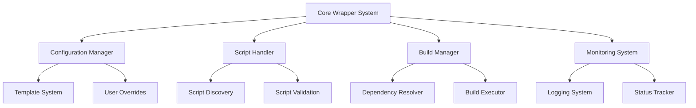
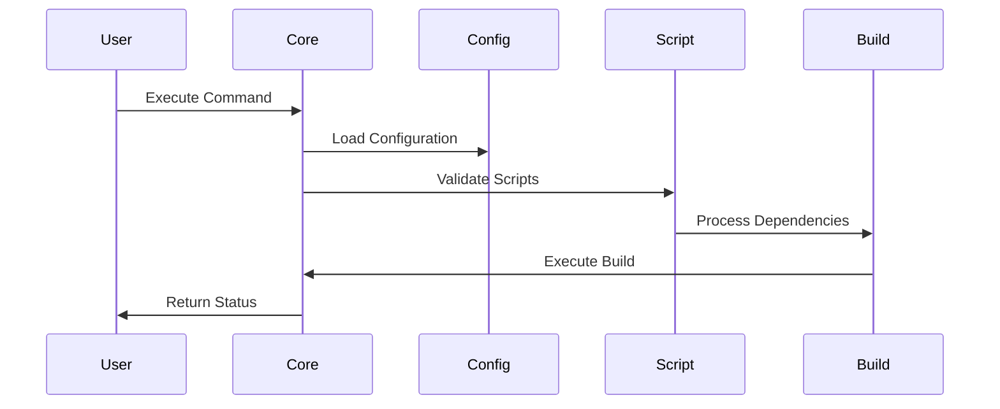
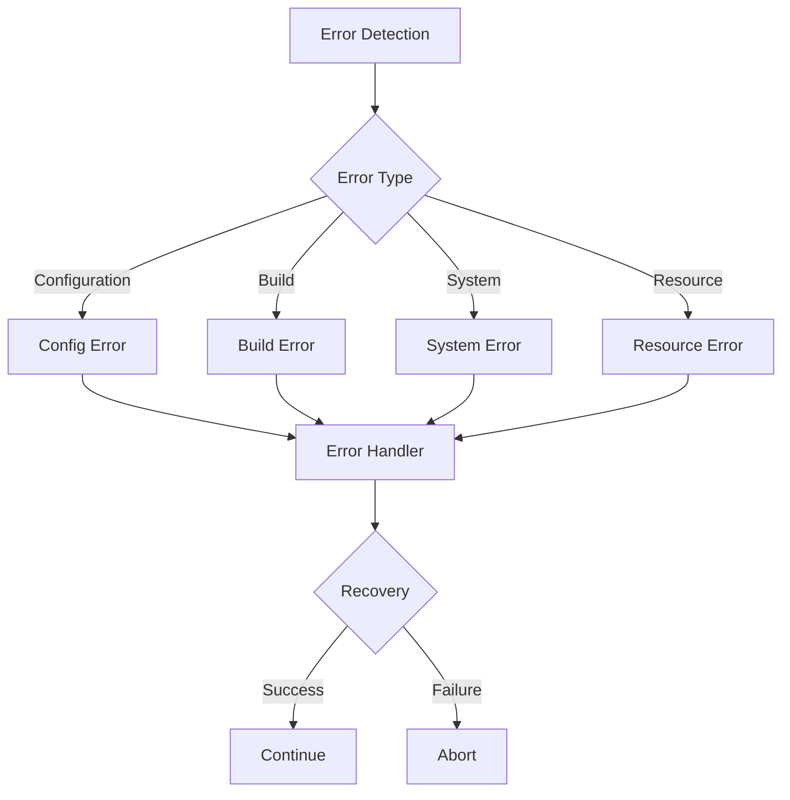
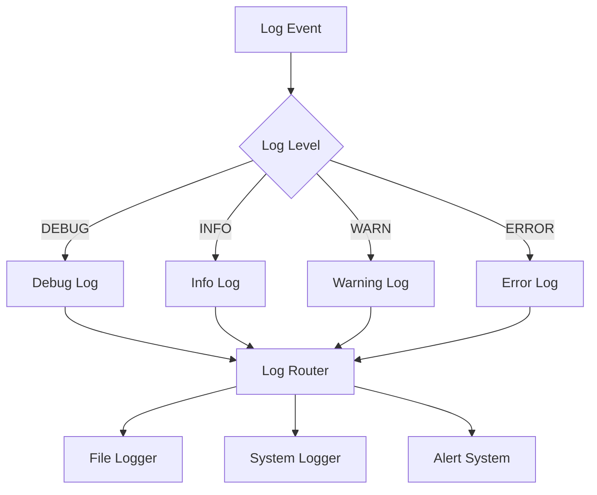
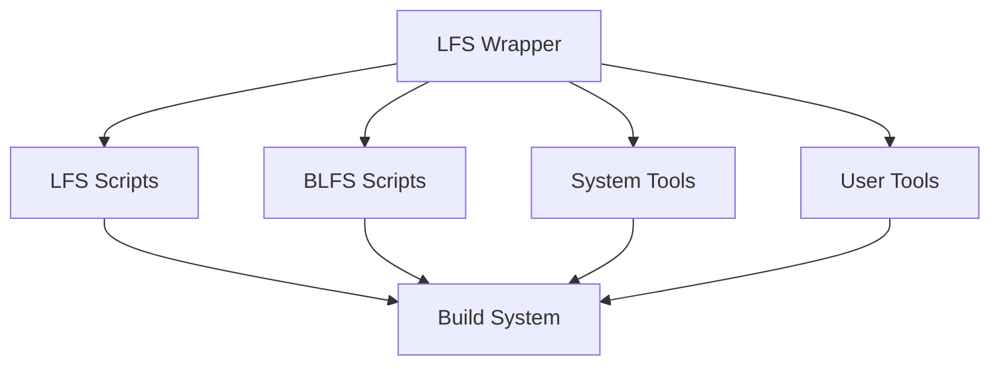

# LFS Build Wrapper System - System Design

## System Architecture

### Component Overview


### Component Descriptions

#### 1. Core Wrapper System
- Central control system
- Command processing
- State management
- Resource coordination
- Error handling

#### 2. Configuration Manager
- Configuration file handling
- Environment management
- User preferences
- System defaults
- Validation rules

#### 3. Script Handler
- Script discovery
- Validation
- Dependency tracking
- Version management
- Execution control

#### 4. Build Manager
- Build sequence control
- Resource allocation
- Progress tracking
- Error recovery
- State preservation

#### 5. Monitoring System
- Real-time monitoring
- Status reporting
- Resource tracking
- Alert generation
- Performance metrics

## Component Interactions

### 1. Core System Integration
```bash
                    ┌─────────────────┐
                    │  Core Wrapper   │
                    └────────┬────────┘
           ┌────────────────┼────────────────┐
    ┌──────┴──────┐  ┌──────┴──────┐  ┌─────┴──────┐
    │   Config    │  │   Script    │  │   Build    │
    │   Manager   │  │   Handler   │  │  Manager   │
    └──────┬──────┘  └──────┬──────┘  └─────┬──────┘
           │               │                │
    ┌──────┴──────┐  ┌─────┴─────┐   ┌────┴─────┐
    │  Settings   │  │  Scripts  │   │  Builds  │
    └─────────────┘  └───────────┘   └──────────┘
```

### 2. Data Flow


## Configuration System Design

### 1. Configuration Hierarchy
```yaml
system:
  # System-wide settings
  paths:
    scripts: /opt/lfs-wrapper/scripts
    builds: /var/lib/lfs-wrapper/builds
    logs: /var/log/lfs-wrapper
  
  defaults:
    parallel_builds: 2
    log_level: INFO
    retry_count: 3

user:
  # User-specific overrides
  preferences:
    notify_on_completion: true
    save_build_logs: true
    compress_logs: true

build:
  # Build-specific settings
  environment:
    MAKEFLAGS: -j4
    CFLAGS: -O2
    CXXFLAGS: -O2
```

### 2. Configuration Management
```bash
function load_configuration() {
    # Load order:
    # 1. System defaults
    # 2. User configuration
    # 3. Build-specific settings
    # 4. Command-line overrides
    
    load_system_defaults
    merge_user_config
    apply_build_settings
    process_cli_overrides
}
```

## Error Handling Framework

### 1. Error Classification


### 2. Error Recovery Process
```bash
function handle_error() {
    local error_type="$1"
    local error_code="$2"
    local context="$3"
    
    # 1. Log error details
    log_error "${error_type}" "${error_code}" "${context}"
    
    # 2. Determine recovery strategy
    strategy=$(get_recovery_strategy "${error_type}" "${error_code}")
    
    # 3. Attempt recovery
    if execute_recovery "${strategy}"; then
        log_success "Recovery successful"
        return 0
    else
        log_failure "Recovery failed"
        return 1
    fi
}
```

## Logging System Design

### 1. Logging Architecture


### 2. Log Management
```bash
function manage_logs() {
    # Configuration
    local max_size="100M"
    local rotate_count=5
    local compress=true
    
    # Monitor log sizes
    check_log_sizes
    
    # Rotate if needed
    if needs_rotation; then
        rotate_logs
        cleanup_old_logs
    fi
    
    # Compress old logs
    if [[ $compress == true ]]; then
        compress_old_logs
    fi
}
```

## System Integration Points

### 1. External Systems


### 2. Integration Methods
- Script wrapping
- Environment injection
- Status monitoring
- Resource management
- Error propagation

## Security Considerations

### 1. Permission Management
```bash
# Permission structure
/opt/lfs-wrapper/
├── bin/          # rwxr-xr-x root:root
├── etc/          # rwxr-xr-x root:root
│   └── config/   # rw-r----- root:lfs
├── var/          # rwxr-xr-x root:root
│   └── log/      # rwxrwx--- root:lfs
└── scripts/      # rwxr-xr-x root:root
```

### 2. Security Measures
- Privilege separation
- Resource limits
- Input validation
- Secure defaults
- Audit logging

## Performance Optimization

### 1. Build Optimization
- Parallel builds
- Resource allocation
- Cache management
- I/O optimization
- Memory management

### 2. System Monitoring
- Resource usage
- Build times
- Success rates
- Error patterns
- Performance metrics

## Implementation Guidelines

### 1. Coding Standards
- Shell script best practices
- Error handling requirements
- Logging standards
- Documentation requirements
- Testing requirements

### 2. Development Workflow
- Version control
- Code review
- Testing process
- Documentation
- Deployment

---
Last Updated: 2025-05-31T15:32:30Z
Status: COMPLETED
Implementation Ready: YES

# LFS Build Wrapper System Design
Generated: 2025-05-31T15:31:00Z
Status: DRAFT
References: LFS_BUILD_ANALYSIS.md, interface_requirements.md, error_handling_requirements.md

## 1. System Architecture

### 1.1 High-Level Architecture Diagram
```
                                    +------------------------+
                                    |    Command Interface   |
                                    |  (lfs-wrapper binary)  |
                                    +------------------------+
                                              |
                    +-------------------------+-------------------------+
                    |                         |                        |
         +-----------------+        +------------------+      +----------------+
         | Config Manager  |        |  Build Manager   |      | Plugin System |
         +-----------------+        +------------------+      +----------------+
                 |                          |                        |
         +-----------------+        +------------------+      +----------------+
         |  Environment   |        | Script Handler   |      |    Hooks      |
         |   Manager      |        |    System        |      |   Manager     |
         +-----------------+        +------------------+      +----------------+
                 |                          |                        |
         +-----------------+        +------------------+      +----------------+
         | State Manager   |        | Resource Manager |      |   Monitor     |
         +-----------------+        +------------------+      +----------------+
                    |                         |                        |
                    +-------------------------+-------------------------+
                                              |
                                    +------------------------+
                                    |   Core Event Bus      |
                                    +------------------------+
                                              |
                    +-------------------------+-------------------------+
                    |                         |                        |
         +-----------------+        +------------------+      +----------------+
         |  Error Handler  |        | Progress Tracker |      |    Logger     |
         +-----------------+        +------------------+      +----------------+
                 |                          |                        |
         +-----------------+        +------------------+      +----------------+
         |   Recovery     |        |    Metrics       |      |   Archiver    |
         |   System       |        |    Collector     |      |               |
         +-----------------+        +------------------+      +----------------+
```

### 1.2 Component Responsibilities

1. **Command Interface**
   - User interaction
   - Command parsing
   - Help system
   - Initial validation

2. **Core Managers**
   - Config Manager: Configuration handling
   - Build Manager: Build process control
   - Plugin System: Extension management

3. **Support Systems**
   - Environment Manager: System environment
   - Script Handler: Script execution
   - Hooks Manager: Extension points

4. **Resource Control**
   - State Manager: System state tracking
   - Resource Manager: Resource allocation
   - Monitor: System monitoring

5. **Event Systems**
   - Core Event Bus: Event distribution
   - Error Handler: Error management
   - Progress Tracker: Build progress

6. **Logging Systems**
   - Logger: Log management
   - Metrics Collector: Performance data
   - Archiver: Log archival

## 2. Component Interaction Specifications

### 2.1 Event-Based Communication
```yaml
event_types:
  build:
    - build.start
    - build.progress
    - build.complete
    - build.error
  
  system:
    - system.ready
    - system.busy
    - system.error
    - system.shutdown
  
  resource:
    - resource.allocated
    - resource.released
    - resource.depleted
    - resource.available
```

### 2.2 Message Protocol
```json
{
    "event": "event.type",
    "timestamp": "ISO8601",
    "source": "component_id",
    "target": "component_id",
    "priority": "priority_level",
    "payload": {
        "data": "event_specific_data",
        "context": "execution_context"
    }
}
```

### 2.3 Component Communication Matrix
```
Component          | Publishes                  | Subscribes
-------------------|----------------------------|-------------------
Command Interface  | commands, user.input       | status, errors
Config Manager     | config.changed             | system.events
Build Manager      | build.events               | all.events
Plugin System      | plugin.events              | system.events
State Manager      | state.changed              | all.events
Resource Manager   | resource.events            | build.events
Error Handler      | error.events               | all.events
Logger             | log.events                 | all.events
```

## 3. Configuration System Design

### 3.1 Configuration Hierarchy
```
/etc/lfs-wrapper/
├── config.yaml         # System-wide configuration
├── defaults/          # Default configurations
│   ├── build.yaml
│   ├── logging.yaml
│   └── security.yaml
├── profiles/         # Build profiles
│   ├── minimal.yaml
│   ├── standard.yaml
│   └── full.yaml
└── user/            # User-specific configs
    └── config.yaml
```

### 3.2 Configuration Loading Sequence
1. Load system defaults
2. Apply system-wide configuration
3. Load selected profile
4. Apply user configuration
5. Apply command-line overrides

### 3.3 Validation System
```yaml
validation:
  schema:
    location: /etc/lfs-wrapper/schema/
    version_control: true
    auto_update: false
  
  rules:
    type_checking: strict
    dependency_validation: true
    circular_detection: true
    
  response:
    on_error: reject
    on_warning: prompt
    on_missing: default
```

## 4. Error Handling System Design

### 4.1 Error Processing Pipeline
```
Error Detection → Classification → Recovery Planning → Execution → Verification
      ↓               ↓                  ↓               ↓            ↓
   Logging       Notification        Resource           State     Validation
                                   Management         Updates
```

### 4.2 Recovery Strategy Selection
```yaml
recovery_strategies:
  build_failure:
    - clean_workspace
    - restore_checkpoint
    - retry_operation
    - report_failure
  
  resource_exhaustion:
    - release_resources
    - wait_for_availability
    - reduce_parallel_jobs
    - switch_to_minimal
  
  system_error:
    - save_state
    - cleanup_resources
    - restart_components
    - restore_state
```

### 4.3 State Preservation
```yaml
state_management:
  checkpoints:
    frequency: 5m
    retention: 3
    location: /var/lib/lfs-wrapper/checkpoints/
  
  recovery_points:
    automatic: true
    pre_operation: true
    post_operation: true
    on_error: true
```

## 5. Logging Framework Design

### 5.1 Log Management
```yaml
log_management:
  streams:
    file:
      path: /var/log/lfs-wrapper/
      format: structured
      rotation: daily
      compression: true
    
    console:
      format: human
      color: true
      verbosity: dynamic
    
    system:
      facility: local0
      format: cef
      priority: dynamic
```

### 5.2 Metrics Collection
```yaml
metrics:
  collection:
    interval: 10s
    aggregation: 1m
    retention: 30d
  
  categories:
    system:
      - cpu_usage
      - memory_usage
      - disk_io
    build:
      - completion_rate
      - error_rate
      - build_time
    performance:
      - response_time
      - throughput
      - queue_length
```

### 5.3 Analysis Pipeline
```
Raw Logs → Parsing → Aggregation → Analysis → Storage → Archival
    ↓         ↓          ↓           ↓          ↓         ↓
 Filtering  Metrics   Statistics   Patterns   Indexing  Compression
```

## 6. Implementation Phases

### 6.1 Phase 1: Core Infrastructure
1. Command interface
2. Configuration system
3. Basic logging
4. Error handling

### 6.2 Phase 2: Build System
1. Script handling
2. Resource management
3. State tracking
4. Progress monitoring

### 6.3 Phase 3: Advanced Features
1. Plugin system
2. Analytics
3. Recovery system
4. Performance optimization

## 7. Integration Strategy

### 7.1 System Integration
- Filesystem integration
- Process management
- Resource control
- Security boundaries

### 7.2 External Integration
- Package managers
- Build tools
- Monitoring systems
- Backup systems

---
Last Updated: 2025-05-31T15:31:00Z
Status: Initial Draft
Review Required: Yes

