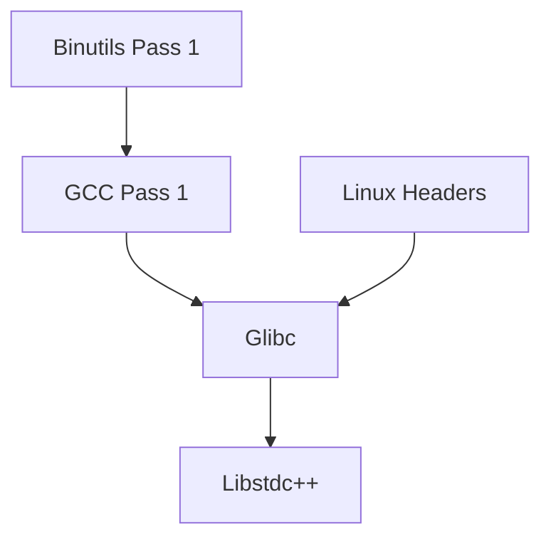

# LFS/BLFS Build Scripts Analysis
Version: 1.0
Last Updated: 2025-05-31T15:03:28Z

## Overview
This document provides a comprehensive analysis of the LFS/BLFS build script ecosystem, focusing on patterns, dependencies, and requirements for a unified wrapper system.

## Script Analysis

### LFS Build Scripts

#### 1. Core Toolchain Scripts
| Script | Purpose | Dependencies | Common Patterns |
|--------|----------|--------------|-----------------|
| binutils-pass1.sh | Initial binutils build | None | Version validation, compiler flags |
| gcc-pass1.sh | Initial GCC build | binutils-pass1 | Library detection, multilib handling |
| linux-headers.sh | Kernel API headers | None | Kernel version check, header installation |
| glibc.sh | C library build | gcc-pass1, linux-headers | Locale handling, test suite |
| libstdc++.sh | C++ library build | gcc-pass1, glibc | C++ features, standard compliance |

#### 2. Temporary Tools Scripts
| Script | Purpose | Dependencies | Common Patterns |
|--------|----------|--------------|-----------------|
| m4.sh | M4 processor | Core toolchain | Basic build pattern |
| ncurses.sh | Terminal library | Core toolchain | Configure options |
| bash.sh | Shell | Core toolchain | Shell features |
| coreutils.sh | Core utilities | Core toolchain | Large test suite |

### BLFS Build Scripts

#### 1. X Window System
| Script | Purpose | Dependencies | Common Patterns |
|--------|----------|--------------|-----------------|
| xorg-server.sh | X Server | Multiple libraries | Complex dependencies |
| mesa.sh | 3D graphics | xorg-server | GPU detection |
| wayland.sh | Modern display | Multiple libraries | Protocol handling |

#### 2. Desktop Environment
| Script | Purpose | Dependencies | Common Patterns |
|--------|----------|--------------|-----------------|
| gtk.sh | GUI toolkit | X Window System | Feature configuration |
| qt.sh | GUI toolkit | X Window System | Build options |
| gnome.sh | Desktop environment | Multiple packages | Component system |

## Common Patterns Analysis

### 1. Build System Patterns
```bash
# Standard build sequence
./configure --prefix=/usr [options]
make
make check
make install
```

### 2. Error Handling Patterns
```bash
# Common error checks
check_version() {
    # Version validation
}

verify_dependencies() {
    # Dependency checking
}

validate_environment() {
    # Environment validation
}
```

### 3. Logging Patterns
```bash
# Standard logging format
log_build_step() {
    echo "[$(date +%Y-%m-%dT%H:%M:%S%z)] $1: $2"
}

log_error() {
    echo "[ERROR] $1" >&2
}
```

## Dependency Analysis

### 1. Critical Path Dependencies


### 2. Parallel Build Opportunities
- Independent utility builds
- Documentation generation
- Test suite execution
- Post-installation procedures

## Wrapper Requirements

### 1. Functional Requirements
- Unified command interface
- Build state management
- Dependency resolution
- Progress tracking
- Error recovery
- Logging system
- Configuration management

### 2. Interface Specification
```bash
# Primary interface
build-wrapper <command> [options] <target>

# Commands
build      # Execute build script
status     # Check build status
clean      # Clean build artifacts
resume     # Resume interrupted build
validate   # Verify build environment
```

### 3. Configuration Management
```yaml
# Configuration structure
build_wrapper:
  default_options:
    parallel_jobs: 4
    log_level: info
    test_suite: enabled
  environment:
    build_root: /mnt/lfs
    tools_dir: /tools
    sources_dir: /sources
  validation:
    check_space: true
    verify_checksums: true
    run_tests: true
```

## Error Handling Framework

### 1. Error Categories
- Environment errors
- Dependency errors
- Build failures
- Test failures
- System resource errors

### 2. Recovery Procedures
```bash
# Error recovery template
handle_error() {
    local error_type=$1
    local error_message=$2
    
    case $error_type in
        ENV_ERROR)
            validate_and_fix_environment
            ;;
        DEP_ERROR)
            resolve_dependencies
            ;;
        BUILD_ERROR)
            cleanup_and_retry
            ;;
        *)
            escalate_to_user
            ;;
    esac
}
```

### 3. Logging Requirements
- Timestamp for all entries
- Error categorization
- Context information
- Recovery actions
- Build state
- System resources

## Recommendations

### 1. Wrapper System Architecture
- Modular design
- Plugin system for new scripts
- State management system
- Comprehensive logging
- Automated recovery
- Progress tracking

### 2. Implementation Priority
1. Core framework development
2. Basic build functionality
3. Error handling system
4. Logging infrastructure
5. Advanced features

### 3. Development Phases
1. Basic wrapper implementation
2. Script integration
3. Error handling
4. State management
5. Advanced features

## Next Steps
1. Create wrapper system design document
2. Implement basic framework
3. Develop script integration system
4. Build error handling framework
5. Create comprehensive test suite

