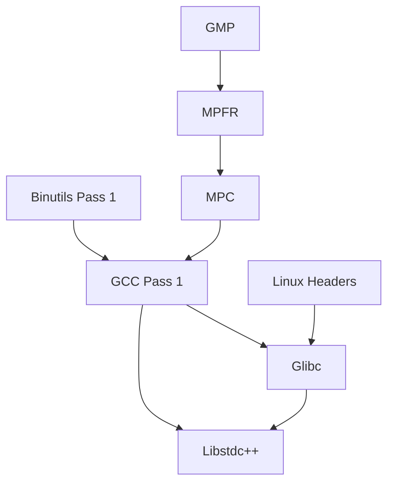
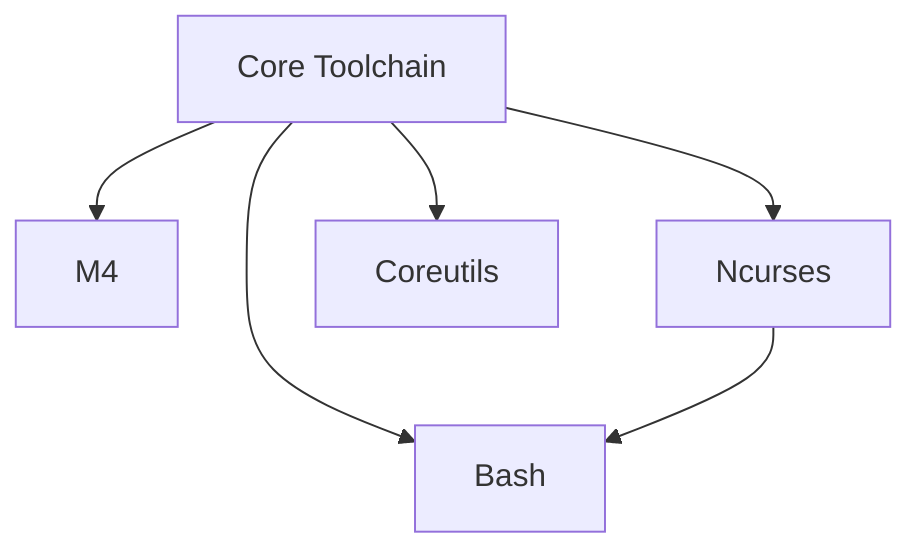
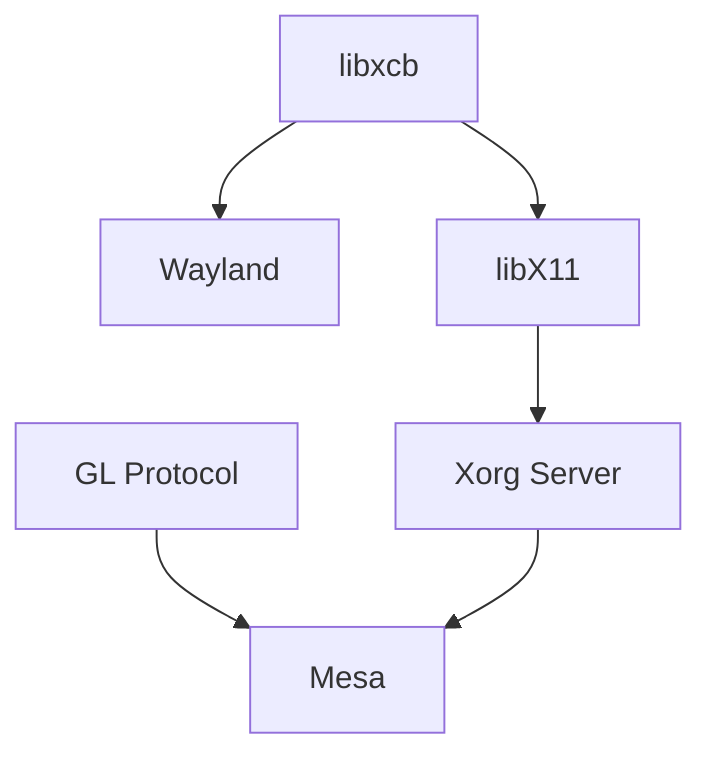
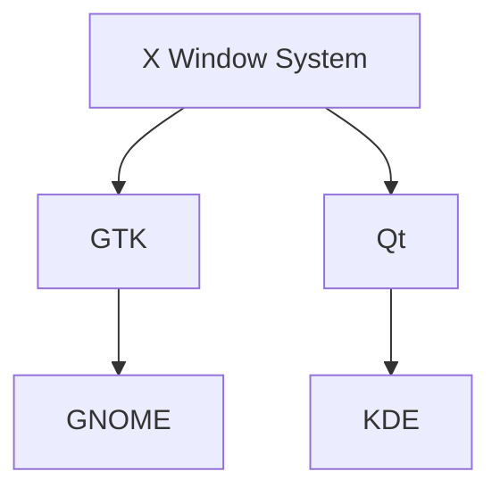
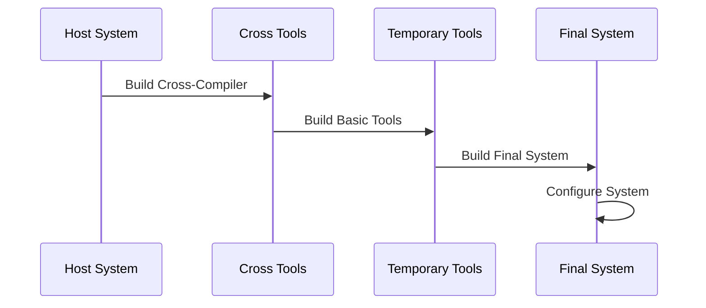
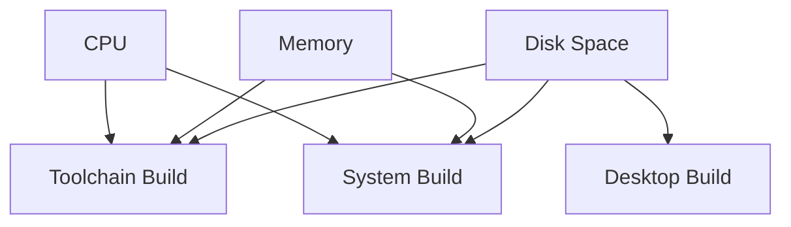
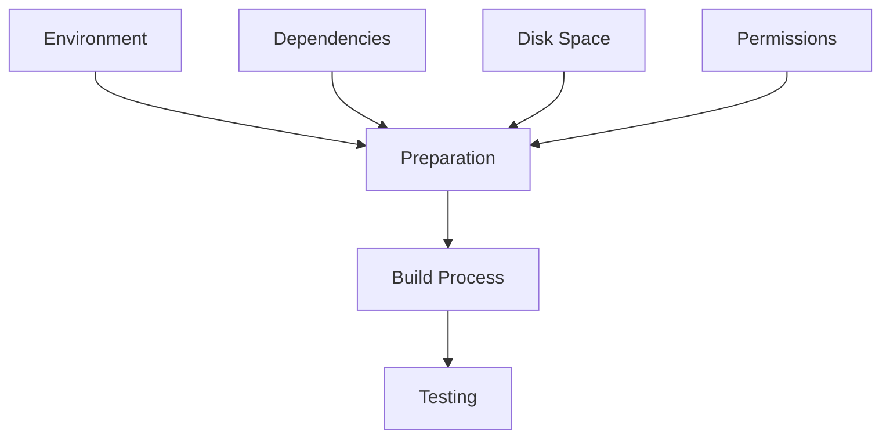

# LFS/BLFS Build Script Dependencies
Version: 1.0
Last Updated: 2025-05-31T15:03:28Z

## Core Toolchain Dependencies

## Temporary Tools Dependencies

## X Window System Dependencies

## Desktop Environment Dependencies

## Build Process Flow

## Resource Dependencies

## Validation Dependencies

## Notes
- Arrows indicate dependencies
- Critical path highlighted in core toolchain
- Resource requirements vary by component
- Validation required at each major stage
- Some dependencies may be parallel-built
- Error handling needed at all stages

