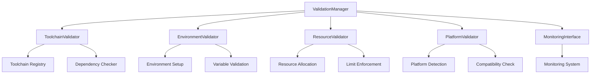

# Cross-Compilation Validation Framework
**Version: 1.0.0**
Last Updated: 2025-05-31

## 1. System Architecture

### 1.1 Core Components

#### ValidationManager
```python
class ValidationManager:
    def __init__(self, config: Dict[str, Any]):
        self.toolchain_validator: ToolchainValidator
        self.environment_validator: EnvironmentValidator
        self.resource_validator: ResourceValidator
        self.platform_validator: PlatformValidator
        self.monitoring_interface: MonitoringInterface
```

#### Platform Validation
```python
class PlatformValidator:
    def validate_platform(self, platform: BuildPlatform) -> ValidationResult:
        """Validate platform requirements."""
        1. Check architecture compatibility
        2. Verify toolchain availability
        3. Validate system requirements
        4. Check resource availability
        5. Verify monitoring support
```

### 1.2 Integration Architecture



## 2. Validation Framework

### 2.1 Validation Rules

#### Architecture Rules
1. Host-Target Compatibility
   ```python
   def validate_architecture_compatibility():
       """Validate host and target architecture compatibility."""
       1. Check host architecture
       2. Verify target support
       3. Validate instruction sets
       4. Check ABI compatibility
       5. Verify platform support
   ```

2. Resource Requirements
   ```python
   def validate_resource_requirements():
       """Validate platform-specific resource requirements."""
       1. Check memory requirements
       2. Verify disk space
       3. Validate CPU capabilities
       4. Check network requirements
       5. Verify I/O capacity
   ```

### 2.2 Validation Levels

| Level | Description | Requirements | Monitoring |
|-------|-------------|--------------|------------|
| L1 | Basic Compatibility | Architecture, OS | State tracking |
| L2 | Resource Validation | Memory, CPU, Disk | Resource monitoring |
| L3 | Toolchain Verification | Compiler, Linker | Build monitoring |
| L4 | Full Integration | All Components | Complete monitoring |

## 3. Environment Validation

### 3.1 Environment Requirements

```python
class EnvironmentValidator:
    def validate_environment(self) -> ValidationResult:
        """Validate build environment."""
        required_vars = {
            "CROSS_COMPILE": str,
            "TARGET_ARCH": str,
            "TOOLCHAIN_PREFIX": str,
            "BUILD_ROOT": Path,
            "TARGET_SYSROOT": Path
        }
        
        required_tools = {
            "compiler": f"{TOOLCHAIN_PREFIX}-gcc",
            "linker": f"{TOOLCHAIN_PREFIX}-ld",
            "archiver": f"{TOOLCHAIN_PREFIX}-ar"
        }
        
        required_paths = [
            "TOOLCHAIN_PATH",
            "SYSROOT_PATH",
            "BUILD_PATH"
        ]
```

### 3.2 Validation Procedures

1. Environment Setup
   ```python
   def setup_environment():
       """Set up cross-compilation environment."""
       1. Load platform config
       2. Set environment variables
       3. Configure paths
       4. Initialize toolchain
       5. Verify setup
   ```

2. Variable Validation
   ```python
   def validate_variables():
       """Validate environment variables."""
       1. Check required variables
       2. Validate formats
       3. Verify paths
       4. Check permissions
       5. Validate values
   ```

## 4. Resource Management

### 4.1 Resource Requirements

| Resource | Base Requirement | Scaling Factor | Monitoring |
|----------|-----------------|----------------|------------|
| Memory | 4GB | 1.5x per core | Real-time |
| Disk | 20GB | 2x for cache | Periodic |
| CPU | 2 cores | Platform specific | Continuous |
| Network | 100Mbps | Build dependent | On-demand |

### 4.2 Resource Allocation

```python
class ResourceAllocator:
    def allocate_resources(self, platform: BuildPlatform) -> ResourceAllocation:
        """Allocate platform-specific resources."""
        1. Calculate requirements
        2. Reserve resources
        3. Configure limits
        4. Setup monitoring
        5. Enable tracking
```

## 5. Platform-Specific Requirements

### 5.1 Platform Validation

```python
class PlatformRequirements:
    architecture_requirements = {
        "x86_64": {
            "minimum_memory": "4GB",
            "recommended_memory": "8GB",
            "minimum_cores": 2,
            "instruction_sets": ["sse4.2", "avx2"]
        },
        "aarch64": {
            "minimum_memory": "4GB",
            "recommended_memory": "8GB",
            "minimum_cores": 2,
            "instruction_sets": ["neon", "crypto"]
        }
    }
    
    toolchain_requirements = {
        "x86_64": ["gcc", "binutils", "glibc"],
        "aarch64": ["gcc-aarch64", "binutils-aarch64", "glibc-aarch64"]
    }
```

### 5.2 Compatibility Matrices

| Host Arch | Target Arch | Toolchain | Status |
|-----------|-------------|-----------|---------|
| x86_64 | x86_64 | Native | ✓ |
| x86_64 | aarch64 | Cross | ✓ |
| x86_64 | arm | Cross | ✓ |
| aarch64 | aarch64 | Native | ✓ |
| aarch64 | arm | Cross | ✓ |

## 6. Monitoring Integration

### 6.1 Monitoring Points

```python
class MonitoringPoints:
    validation_events = {
        "toolchain_validation": {
            "frequency": "pre-build",
            "metrics": ["version", "compatibility"],
            "alerts": ["incompatible", "outdated"]
        },
        "environment_validation": {
            "frequency": "continuous",
            "metrics": ["variables", "paths"],
            "alerts": ["missing", "invalid"]
        },
        "resource_validation": {
            "frequency": "periodic",
            "metrics": ["usage", "availability"],
            "alerts": ["insufficient", "exhausted"]
        }
    }
```

### 6.2 Integration Interface

```python
class MonitoringInterface:
    def register_validation_events(self):
        """Register validation events with monitoring system."""
        1. Define event types
        2. Register handlers
        3. Setup metrics
        4. Configure alerts
        5. Enable tracking

    def report_validation_status(self, status: ValidationStatus):
        """Report validation status to monitoring system."""
        1. Format status
        2. Add metrics
        3. Include resources
        4. Set timestamps
        5. Dispatch event
```

## 7. Security Considerations

### 7.1 Validation Security

1. Toolchain Security
   - Signature verification
   - Source validation
   - Version control
   - Access control
   - Audit logging

2. Environment Security
   - Variable sanitization
   - Path validation
   - Permission control
   - Resource isolation
   - Access logging

### 7.2 Security Protocols

```python
class SecurityProtocols:
    def validate_security():
        """Validate security requirements."""
        1. Check signatures
        2. Verify permissions
        3. Validate sources
        4. Check isolation
        5. Log access
```

## 8. Error Handling

### 8.1 Validation Errors

```python
class ValidationErrorHandler:
    def handle_error(self, error: ValidationError):
        """Handle validation errors."""
        1. Classify error
        2. Log details
        3. Clean resources
        4. Notify monitoring
        5. Execute recovery
```

### 8.2 Recovery Procedures

1. Toolchain Recovery
   - Backup toolchain
   - Alternative paths
   - Version fallback
   - Clean rebuild
   - State recovery

2. Environment Recovery
   - Reset variables
   - Clean paths
   - Restore defaults
   - Rebuild environment
   - State synchronization

