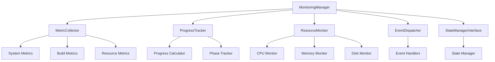

# Progress Monitoring System Design
**Version: 1.0.0**
Last Updated: 2025-05-31

## 1. System Architecture

### 1.1 Core Components

#### MonitoringManager
```python
class MonitoringManager:
    def __init__(self, config: Dict[str, Any]):
        self.metric_collector: MetricCollector
        self.progress_tracker: ProgressTracker
        self.resource_monitor: ResourceMonitor
        self.event_dispatcher: EventDispatcher
        self.state_interface: StateManagerInterface
```

#### Event System
```python
class EventDispatcher:
    def dispatch_event(self, event: MonitoringEvent) -> None
    def register_handler(self, event_type: str, handler: Callable) -> None
    def unregister_handler(self, event_type: str, handler: Callable) -> None
```

#### Metric Collection
```python
class MetricCollector:
    def collect_metrics(self) -> Dict[str, Any]
    def register_collector(self, collector: MetricProvider) -> None
    def aggregate_metrics(self, timeframe: TimeFrame) -> MetricReport
```

### 1.2 Integration Architecture



## 2. Real-time Monitoring

### 2.1 Event-driven Updates

```python
class MonitoringEvent:
    def __init__(self, event_type: str, data: Dict[str, Any]):
        self.type = event_type
        self.timestamp = datetime.utcnow()
        self.data = data
        self.source = EventSource
```

### 2.2 Update Frequency

| Metric Type | Update Frequency | Aggregation Window |
|-------------|------------------|-------------------|
| System Stats | 1 second        | 5 minutes        |
| Build Progress | On state change | N/A             |
| Resource Usage | 5 seconds      | 1 minute         |
| Performance | 10 seconds      | 15 minutes       |

### 2.3 Real-time Processing

```python
class RealTimeProcessor:
    def process_metric_update(self, metric: Metric) -> None:
        """Process metric updates in real-time."""
        1. Validate metric data
        2. Apply aggregation rules
        3. Check thresholds
        4. Dispatch events
        5. Update state
```

## 3. Progress Tracking

### 3.1 Progress Calculation

```python
class ProgressCalculator:
    def calculate_phase_progress(self, phase: BuildPhase) -> float:
        """Calculate progress percentage for current phase."""
        1. Get phase milestones
        2. Check completed steps
        3. Calculate completion percentage
        4. Apply phase weights
        5. Return progress value

    def calculate_overall_progress(self) -> float:
        """Calculate overall build progress."""
        1. Get all phases
        2. Calculate phase progress
        3. Apply phase weights
        4. Aggregate results
        5. Return total progress
```

### 3.2 Progress Indicators

| Phase | Indicators | Weight |
|-------|------------|--------|
| INIT | Configuration, Resource Check | 5% |
| SETUP | Dependencies, Environment | 15% |
| BUILD | Compilation, Linking | 40% |
| TEST | Test Execution, Validation | 30% |
| CLEANUP | Resource Release, Artifact Storage | 10% |

## 4. Resource Monitoring

### 4.1 Resource Metrics

```python
class ResourceMetrics:
    cpu_usage: float          # Percentage
    memory_usage: float       # Bytes
    disk_usage: float        # Bytes
    network_bandwidth: float # Bytes/sec
    io_operations: int       # IOPS
```

### 4.2 Threshold Management

```python
class ThresholdManager:
    def check_thresholds(self, metrics: ResourceMetrics) -> List[Alert]:
        """Check resource metrics against thresholds."""
        1. Load threshold configurations
        2. Compare metrics
        3. Generate alerts
        4. Update state
        5. Dispatch events
```

## 5. Status Reporting

### 5.1 Report Types

1. Real-time Status
   - Current phase
   - Progress percentage
   - Active operations
   - Resource utilization

2. Phase Reports
   - Phase completion
   - Time taken
   - Resource usage
   - Issues encountered

3. Build Reports
   - Overall progress
   - Phase summaries
   - Performance metrics
   - Resource efficiency

### 5.2 Report Generation

```python
class ReportGenerator:
    def generate_status_report(self) -> StatusReport:
        """Generate current status report."""
        1. Collect metrics
        2. Calculate progress
        3. Get resource status
        4. Format report
        5. Dispatch update

    def generate_phase_report(self, phase: BuildPhase) -> PhaseReport:
        """Generate phase completion report."""
        1. Collect phase metrics
        2. Calculate statistics
        3. Gather resources
        4. Format report
        5. Archive data
```

## 6. State Management Integration

### 6.1 State Updates

```python
class StateManagerInterface:
    def update_monitoring_state(self, metrics: Dict[str, Any]) -> None:
        """Update state with monitoring data."""
        1. Prepare state update
        2. Validate metrics
        3. Apply update
        4. Create checkpoint
        5. Dispatch event
```

### 6.2 State Synchronization

```python
class StateSynchronizer:
    def synchronize_monitoring_state(self) -> None:
        """Ensure monitoring and build states are synchronized."""
        1. Get current states
        2. Compare timestamps
        3. Resolve conflicts
        4. Apply updates
        5. Verify synchronization
```

## 7. Alerting System

### 7.1 Alert Types

| Level | Description | Action |
|-------|-------------|--------|
| INFO | Normal operations | Log |
| WARNING | Potential issues | Notify |
| ERROR | Operation failures | Alert |
| CRITICAL | System threats | Alert & Pause |

### 7.2 Alert Handling

```python
class AlertHandler:
    def handle_alert(self, alert: Alert) -> None:
        """Process monitoring alerts."""
        1. Classify alert
        2. Apply rules
        3. Take action
        4. Update state
        5. Notify handlers
```

## 8. Performance Considerations

### 8.1 Optimization Strategies

1. Metric Collection
   - Batch processing
   - Sampling rates
   - Data aggregation
   - Caching

2. Event Processing
   - Event buffering
   - Async handling
   - Priority queues
   - Rate limiting

### 8.2 Resource Management

```python
class MonitoringResourceManager:
    def manage_monitoring_resources(self) -> None:
        """Manage monitoring system resources."""
        1. Check resource usage
        2. Apply rate limiting
        3. Adjust sampling
        4. Clean old data
        5. Optimize storage
```

## 9. Security Considerations

### 9.1 Data Protection

1. Metric Data
   - Encryption at rest
   - Secure transmission
   - Access control
   - Data retention

2. Alert System
   - Authentication
   - Authorization
   - Audit logging
   - Alert verification

### 9.2 Access Control

```python
class MonitoringAccessControl:
    def validate_access(self, request: MonitoringRequest) -> bool:
        """Validate monitoring system access."""
        1. Check credentials
        2. Verify permissions
        3. Log access
        4. Apply rules
        5. Grant/deny access
```

