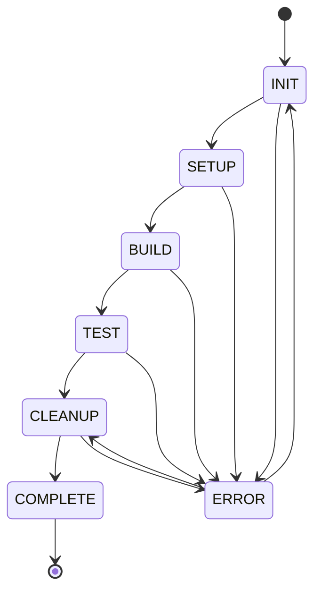

# State Transition Management
**Version: 1.0.0**
Last Updated: 2025-05-31

## 1. State Lifecycle

### 1.1 Build States



### 1.2 State Definitions

| State    | Description                     | Valid Next States       |
|----------|---------------------------------|-----------------------|
| INIT     | Initial state configuration     | SETUP, ERROR         |
| SETUP    | Resource and dependency setup   | BUILD, ERROR         |
| BUILD    | Active build process           | TEST, ERROR          |
| TEST     | Test execution                 | CLEANUP, ERROR       |
| CLEANUP  | Resource cleanup               | COMPLETE, ERROR      |
| COMPLETE | Successful completion          | [Terminal]           |
| ERROR    | Error handling                 | INIT, CLEANUP        |

## 2. Transition Rules

### 2.1 Transition Requirements

#### INIT → SETUP
- Configuration validated
- Resources available
- Dependencies resolved
- Workspace prepared

#### SETUP → BUILD
- All resources allocated
- Build environment ready
- Dependencies installed
- Build script validated

#### BUILD → TEST
- Build completed successfully
- Artifacts generated
- Resources stable
- Test environment ready

#### TEST → CLEANUP
- All tests completed
- Results recorded
- Resources marked for release
- Artifacts preserved

#### CLEANUP → COMPLETE
- Resources released
- Artifacts archived
- Logs finalized
- State persisted

### 2.2 Error Transitions

#### Any State → ERROR
- Resource allocation failure
- Dependency resolution failure
- Build script error
- Test failure
- System error

#### ERROR → INIT/CLEANUP
- Error logged
- Resources released
- State preserved
- Recovery plan created

## 3. Transition Validation

### 3.1 Pre-transition Checks

```python
def validate_transition(current_state: BuildState, target_state: BuildState) -> bool:
    """Validate state transition."""
    1. Check valid transition path
    2. Verify resource requirements
    3. Validate dependencies
    4. Check constraints
    5. Verify prerequisites
```

### 3.2 Post-transition Validation

```python
def verify_transition(from_state: BuildState, to_state: BuildState) -> bool:
    """Verify successful transition."""
    1. Validate new state
    2. Check resource status
    3. Verify artifacts
    4. Confirm dependencies
    5. Update metadata
```

## 4. Transition Handlers

### 4.1 Handler Structure

```python
class TransitionHandler:
    def __init__(self, from_state: BuildPhase, to_state: BuildPhase):
        self.from_state = from_state
        self.to_state = to_state
        self.validators = []
        self.actions = []
        self.rollback_actions = []

    def execute(self, state: BuildState) -> BuildState:
        """Execute transition."""
        1. Run pre-transition validation
        2. Execute transition actions
        3. Validate result
        4. Handle rollback if needed
        5. Return new state
```

### 4.2 Common Transitions

#### Setup Transition
```python
def handle_setup_transition(state: BuildState) -> BuildState:
    """Handle transition to SETUP phase."""
    1. Allocate resources
    2. Prepare environment
    3. Install dependencies
    4. Configure workspace
    5. Update state
```

#### Build Transition
```python
def handle_build_transition(state: BuildState) -> BuildState:
    """Handle transition to BUILD phase."""
    1. Validate environment
    2. Execute build script
    3. Monitor progress
    4. Collect artifacts
    5. Update state
```

## 5. Recovery Transitions

### 5.1 Checkpoint System

```python
class CheckpointManager:
    def create_checkpoint(self, state: BuildState) -> str:
        """Create transition checkpoint."""
        1. Capture state
        2. Save resources
        3. Record dependencies
        4. Store artifacts
        5. Return checkpoint ID

    def restore_checkpoint(self, checkpoint_id: str) -> BuildState:
        """Restore from checkpoint."""
        1. Load state
        2. Restore resources
        3. Verify dependencies
        4. Recover artifacts
        5. Return state
```

### 5.2 Recovery Paths

#### Normal Recovery
1. Identify last valid state
2. Load checkpoint
3. Restore resources
4. Verify state
5. Resume execution

#### Error Recovery
1. Release resources
2. Save error state
3. Create recovery plan
4. Execute rollback
5. Transition to safe state

## 6. Monitoring and Logging

### 6.1 Transition Events
- Transition start/end
- Validation results
- Resource changes
- Error conditions
- Recovery actions

### 6.2 Metrics
- Transition duration
- Success rate
- Resource efficiency
- Error frequency
- Recovery time

## 7. Integration Points

### 7.1 Resource Manager Integration

```python
class ResourceTransitionManager:
    def prepare_resources(self, transition: StateTransition) -> bool:
        """Prepare resources for transition."""
        1. Calculate requirements
        2. Allocate resources
        3. Verify allocation
        4. Update state
        5. Return success

    def cleanup_resources(self, transition: StateTransition) -> bool:
        """Clean up resources after transition."""
        1. Identify resources
        2. Release allocation
        3. Verify cleanup
        4. Update state
        5. Return success
```

### 7.2 Test Framework Integration

```python
class TestTransitionManager:
    def handle_test_transition(self, test_result: TestResult) -> BuildState:
        """Handle test phase transition."""
        1. Validate test results
        2. Update build state
        3. Manage resources
        4. Handle artifacts
        5. Return new state
```

## 8. Security and Validation

### 8.1 Transition Security
- Authorization checks
- Resource validation
- State integrity
- Audit logging
- Error handling

### 8.2 State Validation
- Schema validation
- Resource verification
- Dependency checks
- Artifact validation
- Consistency rules

## 9. Error Handling

### 9.1 Transition Errors
1. Invalid state change
2. Resource allocation failure
3. Dependency error
4. Validation failure
5. System error

### 9.2 Error Recovery
1. Rollback to checkpoint
2. Resource cleanup
3. State restoration
4. Error logging
5. Recovery execution

