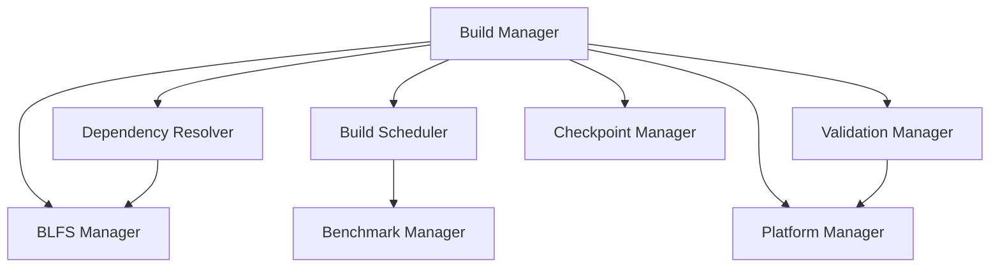

# System Architecture

## System Overview
The LFS/BLFS Build Scripts Wrapper System is designed as a modular, extensible framework for managing complex build processes across different Linux distributions. This document describes the system's architecture, components, and their interactions.

## Core Components

### 1. Build Management System
- **Build Manager** (build_manager.py)
  - Coordinates build process execution
  - Manages build state and environment
  - Handles script execution and monitoring
  - Provides error handling and recovery

### 2. Dependency Resolution System
- **Dependency Resolver** (dependency_resolver.py)
  - Analyzes build dependencies
  - Resolves dependency order
  - Manages version constraints
  - Handles conflict resolution

### 3. Build Scheduling System
- **Build Scheduler** (build_scheduler.py)
  - Manages build order optimization
  - Handles parallel build execution
  - Provides resource allocation
  - Implements priority scheduling

### 4. Validation System
- **Validation Manager** (validation_manager.py)
  - Performs build validation
  - Verifies system integrity
  - Manages validation rules
  - Generates validation reports

### 5. BLFS Integration System
- **BLFS Manager** (blfs_manager.py)
  - Manages BLFS package builds
  - Handles package configuration
  - Provides dependency tracking
  - Implements update management

### 6. Checkpoint System
- **Checkpoint Manager** (checkpoint_manager.py)
  - Manages build state preservation
  - Handles checkpoint creation/restoration
  - Provides verification mechanisms
  - Implements cleanup procedures

### 7. Performance Monitoring
- **Benchmark Manager** (benchmark_manager.py)
  - Collects performance metrics
  - Analyzes build performance
  - Generates performance reports
  - Provides optimization recommendations

### 8. Platform Compatibility
- **Platform Manager** (platform_testing.py)
  - Handles distribution detection
  - Manages platform compatibility
  - Provides platform-specific configuration
  - Implements validation checks

## System Interactions

## Data Flow
1. **Build Initialization**
   - Configuration loading
   - Environment validation
   - Dependency resolution
   - Resource allocation

2. **Build Execution**
   - Script scheduling
   - State management
   - Progress monitoring
   - Error handling

3. **Build Validation**
   - Checkpoint creation
   - State verification
   - Performance monitoring
   - System validation

## Error Handling
- Comprehensive error detection
- Automatic recovery procedures
- State preservation
- Rollback capabilities

## Extension Points
1. **Plugin System**
   - Custom validators
   - Build hooks
   - Monitoring extensions
   - Platform adapters

2. **Configuration System**
   - Platform-specific settings
   - Build profiles
   - Validation rules
   - Performance thresholds

## Security Considerations
1. **Access Control**
   - Permission management
   - Resource limits
   - Secure execution

2. **Data Protection**
   - State preservation
   - Configuration security
   - Build artifact protection

## Performance Optimizations
1. **Build Optimization**
   - Parallel execution
   - Resource allocation
   - Cache management
   - Dependency optimization

2. **Monitoring**
   - Performance tracking
   - Resource usage
   - Bottleneck detection
   - Optimization suggestions

