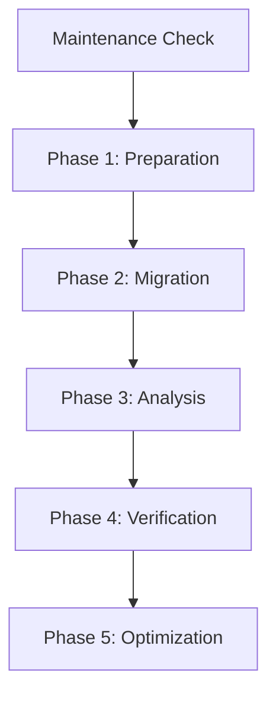

# File Migration Analysis Dependencies

## System Maintenance Requirements

### TIDY Enforcement
- **Last Run:** 2025-05-31T14:42:25Z
- **Next Required:** 2025-06-01T14:42:25Z
- **Enforcement Rule:** Must run if >24 hours since last execution
- **Location:** `/mnt/host/WARP_CURRENT/System Logs/TIDY_LOG.md`
- **Verification:** Check timestamp before any task execution

### ORGANIZE Enforcement
- **Last Run:** 2025-05-31T14:42:25Z
- **Next Required:** 2025-06-01T14:42:25Z
- **Enforcement Rule:** Must run if >24 hours since last execution
- **Location:** `/mnt/host/WARP_CURRENT/System Logs/ORGANIZE_LOG.md`
- **Verification:** Check timestamp before any task execution

## Phase Dependencies

### Phase 1: Preparation
- **Dependencies:** None
- **Required Before:** Phase 2
- **Tasks:** TASK_001, TASK_002, TASK_003
- **Verification:** All tasks complete with success

### Phase 2: Migration
- **Dependencies:** Phase 1
- **Required Before:** Phase 3
- **Tasks:** To be defined after Phase 1
- **Verification:** File transfer complete

### Phase 3: Analysis
- **Dependencies:** Phase 2
- **Required Before:** Phase 4
- **Tasks:** To be defined after Phase 2
- **Verification:** Analysis complete

### Phase 4: Verification
- **Dependencies:** Phase 3
- **Required Before:** Phase 5
- **Tasks:** To be defined after Phase 3
- **Verification:** All checks passed

### Phase 5: Optimization
- **Dependencies:** Phase 4
- **Required Before:** Completion
- **Tasks:** To be defined after Phase 4
- **Verification:** Optimization goals met

## System Requirements

### Hardware Dependencies
- Available disk space: 2GB minimum
- RAM: 2GB minimum
- CPU: 1 core minimum
- Network: Local transfer capability

### Software Dependencies
- rsync
- find
- stat
- sha256sum
- tree
- WARP system components

### Permission Requirements
- Root access for system operations
- Read access to source files
- Write access to destination
- Execute permissions for tools

## WARP System Integration

### Required Components
- TIDY system
- ORGANIZE system
- SIMULATE capabilities
- Logging framework
- Task management
- Status tracking

### System Paths
- Source: `/home/ubuntu`
- Destination: `/mnt/host`
- Backup: `/mnt/host/WARP_CURRENT/Backups`
- Simulation: `/mnt/host/WARP_CURRENT/Simulation`
- Logs: `/mnt/host/WARP_CURRENT/Work Logs`

### Integration Points
1. Task Management
   - Task Pool integration
   - Status updates
   - Dependency tracking
   - Progress monitoring

2. Logging System
   - Work logs
   - Error tracking
   - Performance metrics
   - Status updates

3. Maintenance System
   - TIDY enforcement
   - ORGANIZE enforcement
   - System health monitoring
   - Resource tracking

4. Simulation Framework
   - Pre-execution testing
   - Performance analysis
   - Error condition testing
   - Recovery verification

## Cross-Objective Dependencies

### System Status Requirements
- WARP system operational
- Maintenance current
- Resources available
- No conflicting objectives

### Resource Conflicts
- Check for concurrent file operations
- Monitor system resource usage
- Track disk space allocation
- Verify tool availability

### Timeline Dependencies
- Must complete before any dependent objectives
- Cannot block critical system maintenance
- Must respect maintenance windows
- Must coordinate with other objectives

## Error Handling and Recovery

### Maintenance Failures
1. TIDY Failure
   - Document error condition
   - Attempt recovery
   - Escalate to supervisor
   - Hold task execution

2. ORGANIZE Failure
   - Log failure details
   - Execute recovery procedure
   - Update system status
   - Await supervisor review

### System Failures
1. Resource Exhaustion
   - Free required resources
   - Adjust operation scope
   - Update requirements
   - Retry operation

2. Permission Issues
   - Document affected paths
   - Request access updates
   - Verify changes
   - Resume operation

## Completion Requirements

### Phase Completion
- All tasks in phase complete
- Verification criteria met
- Documentation updated
- Dependencies satisfied

### Maintenance Verification
- TIDY status current
- ORGANIZE status current
- System health verified
- Resources available

### Documentation Requirements
- Status updates logged
- Metrics recorded
- Issues documented
- Dependencies tracked

### Final Verification
- All phases complete
- All checks passed
- Documentation complete
- System stable

