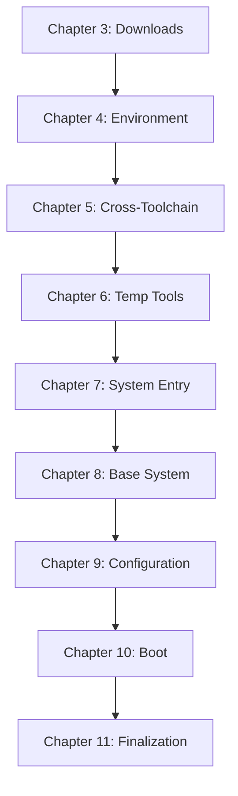

# LFS/BLFS Build Scripts Analysis Report
Generated: 2025-05-31T15:24:00Z
Status: Initial Analysis
Focus: System Architecture & Integration Points

## 1. Script Organization by Chapter

### Core Build Structure
```
BuildScripts/
├── ch3_packages/     # Package Management & Downloads
├── ch4_*/           # Initial Build Environment
├── ch5_*/           # Cross-Toolchain Construction 
├── ch6_*/           # Temporary Tools
├── ch7_*/           # System Entry & Configuration
├── ch8_*/           # Base System Software
├── ch9_*/           # System Configuration
├── ch10_*/          # Bootloader Setup
├── ch11_*/          # System Finalization
└── common/          # Shared Utilities
```

### Key Script Categories
1. **Foundation Scripts**
   - Environment setup (ch4)
   - Directory structure creation
   - Permission management

2. **Toolchain Scripts**
   - Cross-compiler building (ch5)
   - Temporary tools creation (ch6)
   - Final toolchain assembly (ch8)

3. **System Construction**
   - Base package installation (ch8)
   - System configuration (ch9)
   - Boot preparation (ch10)

4. **Support Scripts**
   - Package management (ch3)
   - Testing frameworks
   - Logging utilities
   - Validation tools

## 2. Common Functionality Patterns

### A. Script Structure Pattern
```bash
# Common Script Template
#!/bin/bash
source ../config/variables.sh
source ../common/functions.sh

# 1. Validation
validate_environment()
validate_prerequisites()

# 2. Preparation
prepare_directories()
extract_source()

# 3. Configuration
configure_package()
apply_patches()

# 4. Build & Install
build_package()
run_tests()
install_package()

# 5. Cleanup & Verification
cleanup_build()
verify_installation()
```

### B. Recurring Components
1. **Environment Management**
   - Source configuration
   - Variable validation
   - Path setup

2. **Error Handling**
   - Status checking
   - Error logging
   - Recovery procedures

3. **Progress Tracking**
   - Build status updates
   - Checkpoint creation
   - Log management

4. **Resource Management**
   - Directory preparation
   - File cleanup
   - Permission setting

## 3. Critical Dependencies

### A. System-Level Dependencies
1. **Build Environment**
   - Host system requirements
   - Required utilities
   - Filesystem access

2. **Toolchain Dependencies**
   - GCC and related tools
   - Binutils
   - Development libraries

3. **Configuration Dependencies**
   - System paths
   - Build flags
   - Environment variables

### B. Inter-Chapter Dependencies


## 4. Integration Points

### A. Primary Integration Interfaces
1. **Package Management Interface**
   ```bash
   # ch3_packages/functions/
   ├── download_manager.sh
   ├── checksum_verification.sh
   ├── package_tracker.sh
   └── patch_manager.sh
   ```

2. **Build System Interface**
   ```bash
   # BuildScripts/common/
   ├── build_functions.sh
   ├── error_handling.sh
   ├── logging_system.sh
   └── validation.sh
   ```

3. **Configuration Interface**
   ```bash
   # Config/
   ├── lfs_config.sh
   └── variables.sh
   ```

### B. Cross-Chapter Integration
1. **Shared Resources**
   - Common function libraries
   - Configuration files
   - Log directories

2. **State Management**
   - Build progress tracking
   - System state validation
   - Checkpoint management

## 5. Current Build Workflow

### A. High-Level Flow
1. **Initialization Phase**
   - Environment validation
   - Directory setup
   - Tool verification

2. **Preparation Phase**
   - Package download
   - Checksum verification
   - Patch preparation

3. **Build Phase**
   - Cross-toolchain construction
   - Temporary tools creation
   - System software building

4. **Configuration Phase**
   - System setup
   - Boot configuration
   - Final validation

### B. Control Flow
1. **Sequential Execution**
   - Chapter-by-chapter progression
   - Dependency-based ordering
   - Validation checkpoints

2. **Error Management**
   - Failure detection
   - Recovery procedures
   - State preservation

3. **Progress Tracking**
   - Build logs
   - Status updates
   - Completion verification

## 6. Wrapper System Implementation Recommendations

### A. Core Components
1. **Unified Interface Layer**
   - Single entry point
   - Consistent command structure
   - Standard output format

2. **Build Management System**
   - Dependency resolution
   - Progress tracking
   - Error handling

3. **Configuration Management**
   - Central config store
   - Environment management
   - Build customization

### B. Integration Strategy
1. **Wrapper Architecture**
   ```
   Wrapper/
   ├── core/          # Core functionality
   ├── interfaces/    # Integration points
   ├── handlers/      # Script handlers
   ├── config/        # Configuration
   └── utils/         # Utilities
   ```

2. **Implementation Phases**
   - Core framework development
   - Script integration
   - Testing & validation
   - Documentation

## 7. Next Steps

1. **Immediate Actions**
   - [ ] Create wrapper system skeleton
   - [ ] Implement core interfaces
   - [ ] Develop script handlers
   - [ ] Build configuration system

2. **Documentation Needs**
   - [ ] Interface specifications
   - [ ] Integration guides
   - [ ] Error handling procedures
   - [ ] Operational workflows

---
Analysis completed: 2025-05-31T15:24:00Z

