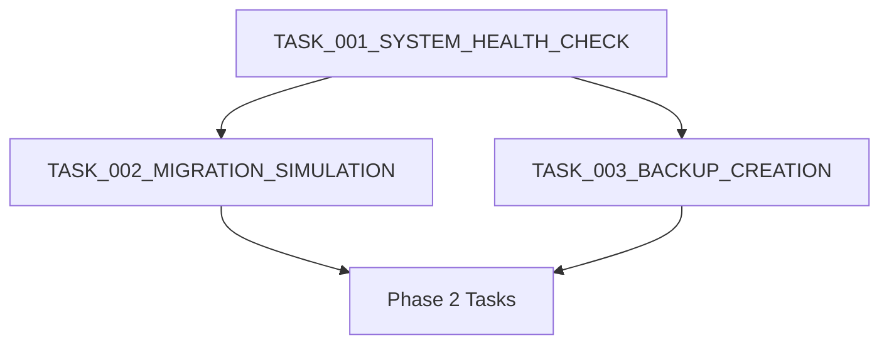

# Task Dependencies and Execution Order

## Phase 1 Task Dependencies

## Execution Order
1. TASK_001_SYSTEM_HEALTH_CHECK
   - Prerequisites: None
   - Blockers: None
   - Must complete before: TASK_002, TASK_003

2. TASK_002_MIGRATION_SIMULATION
   - Prerequisites: TASK_001
   - Blockers: Failed system health check
   - Must complete before: Phase 2 tasks

3. TASK_003_BACKUP_CREATION
   - Prerequisites: TASK_001
   - Blockers: Failed system health check
   - Must complete before: Phase 2 tasks

## Future Dependencies
- Phase 2 tasks will be defined after successful completion of Phase 1
- Each phase must complete all tasks before proceeding to next phase
- Dependencies will be updated as new tasks are created

## Checkpoint Requirements
- All Phase 1 tasks must pass verification
- System health check must remain valid
- Backup verification must be confirmed
- Simulation results must be documented

## Task Status Tracking
| Task ID | Status | Dependencies | Blocked By |
|---------|--------|--------------|------------|
| TASK_001 | Pending | None | None |
| TASK_002 | Pending | TASK_001 | None |
| TASK_003 | Pending | TASK_001 | None |

