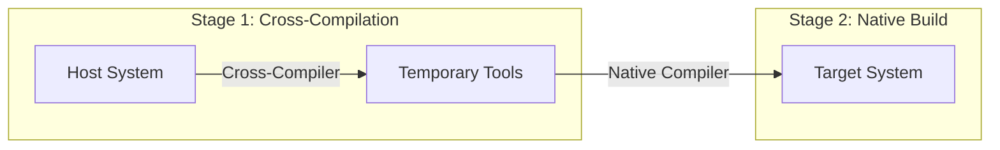
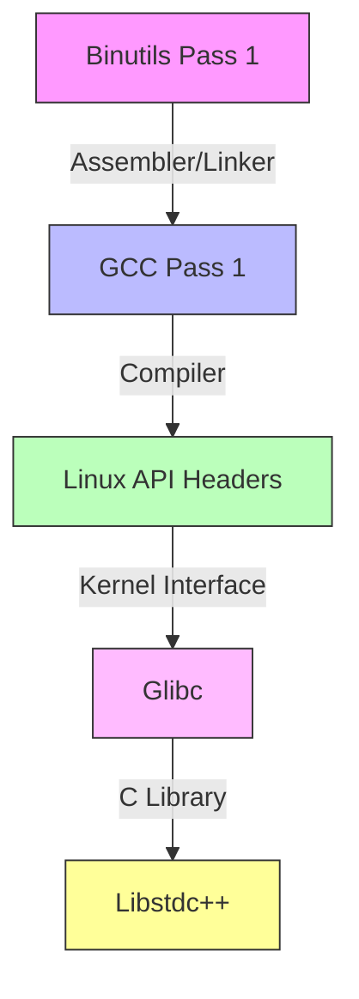

# LFS Cross-Toolchain Architecture
Version: 1.0
Last Updated: 2025-05-31
Status: Draft

## Overview

This document details the architecture and build process for the LFS cross-toolchain construction (Chapter 5). The cross-toolchain is essential for building a new Linux system that is independent of the host system's libraries and toolchain.

## Cross-Compilation Concepts

### Host vs Target Environment



### Build System Terminology
- **Host**: The system where we build our toolchain
- **Target**: The system where the compiled programs will run
- **Build**: The system where the build tools run

### Cross-Compilation Phases
1. **Pass 1**: Build minimal cross-compilation tools
2. **Pass 2**: Build basic native toolchain
3. **Final**: Build complete target system

## Build Order Dependencies

### Component Flow


### Detailed Build Sequence
1. **Binutils (Pass 1)**
   - Purpose: Create assembler and linker for target
   - Dependencies: None
   - Critical Options:
     ```bash
     --target=$LFS_TGT
     --with-sysroot=$LFS
     --disable-nls
     --disable-werror
     ```

2. **GCC (Pass 1)**
   - Purpose: Create cross-compiler
   - Dependencies: 
     - Binutils (Pass 1)
     - GMP, MPFR, MPC (Internal)
   - Critical Options:
     ```bash
     --target=$LFS_TGT
     --with-glibc-version=2.41
     --with-newlib
     --without-headers
     ```

3. **Linux API Headers**
   - Purpose: Expose kernel interface
   - Dependencies: None
   - Key Operations:
     ```bash
     make mrproper
     make headers
     ```

4. **Glibc**
   - Purpose: Provide C library
   - Dependencies:
     - GCC (Pass 1)
     - Linux API Headers
   - Critical Options:
     ```bash
     --host=$LFS_TGT
     --build=$(../scripts/config.guess)
     --enable-kernel=5.4
     ```

5. **Libstdc++**
   - Purpose: Provide C++ support
   - Dependencies:
     - GCC (Pass 1)
     - Glibc
   - Critical Options:
     ```bash
     --host=$LFS_TGT
     --disable-multilib
     --disable-nls
     ```

## Component Relationships

### Toolchain Component Matrix

| Component        | Depends On      | Required For    | Critical For    |
|-----------------|-----------------|-----------------|-----------------|
| Binutils Pass 1 | -              | GCC Pass 1      | Assembling     |
| GCC Pass 1      | Binutils       | Glibc           | Compiling      |
| Linux Headers   | -              | Glibc           | Kernel Interface|
| Glibc          | GCC, Headers    | Libstdc++       | C Library      |
| Libstdc++      | GCC, Glibc     | Full Toolchain  | C++ Support    |

### Critical Configuration Aspects

1. **Sysroot Configuration**
   ```bash
   # Purpose: Isolate from host system
   --with-sysroot=$LFS
   # Used by: Binutils, GCC
   ```

2. **Target Specification**
   ```bash
   # Format: <machine>-lfs-linux-gnu
   # Example: x86_64-lfs-linux-gnu
   LFS_TGT=$(uname -m)-lfs-linux-gnu
   ```

3. **Build Protection**
   ```bash
   # Prevent host contamination
   set +h          # Disable hash table
   umask 022       # Safe permissions
   LC_ALL=POSIX    # Consistent locale
   ```

## Build Validation Requirements

### Pre-build Checks
1. Verify host system compatibility
2. Validate all required packages
3. Check disk space requirements
4. Verify build user setup

### Build-time Validation
1. **Component Checks**
   ```bash
   # Example: GCC test
   echo 'int main(){}' > dummy.c
   $LFS_TGT-gcc dummy.c
   readelf -l a.out | grep ': /lib'
   ```

2. **Library Checks**
   ```bash
   # Example: Glibc test
   echo 'int main(){}' > dummy.c
   $LFS_TGT-gcc dummy.c
   readelf -l a.out | grep interpreter
   ```

### Post-build Validation
1. Verify toolchain isolation
2. Check library dependencies
3. Validate compiler functionality
4. Test basic compilation

## Error Recovery Procedures

### Common Issues
1. **Missing Prerequisites**
   - Verify host system packages
   - Check build user environment
   - Validate permissions

2. **Build Failures**
   - Check build logs
   - Verify configuration options
   - Validate dependencies

3. **Contamination Issues**
   - Verify PATH settings
   - Check sysroot configuration
   - Validate environment isolation

### Recovery Steps
1. Clean build directory
2. Verify environment
3. Rebuild failed component
4. Validate toolchain integrity

## Security Considerations

1. **Isolation**
   - Strict PATH control
   - Sysroot enforcement
   - Build user restrictions

2. **Permissions**
   - Controlled access to $LFS
   - Protected build directories
   - Secure file ownership

3. **Validation**
   - Checksum verification
   - Build signature validation
   - Component testing

## Reference Information

### Build Times
- Binutils Pass 1: 1.0 SBU
- GCC Pass 1: 12.0 SBU
- Linux API Headers: 0.1 SBU
- Glibc: 4.0 SBU
- Libstdc++: 0.8 SBU

### Resource Requirements
- Disk Space: ~4GB
- Memory: 4GB minimum
- CPU Cores: Supports parallel build

### Documentation References
- LFS Book Chapter 5
- GCC Documentation
- Binutils User Manual
- Glibc Manual

Note: All build times are based on standard build unit (SBU) measurements.

