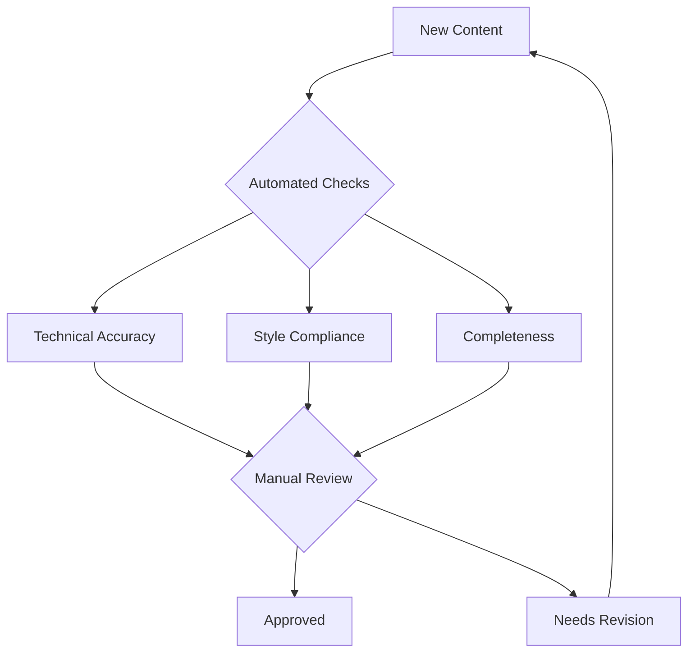
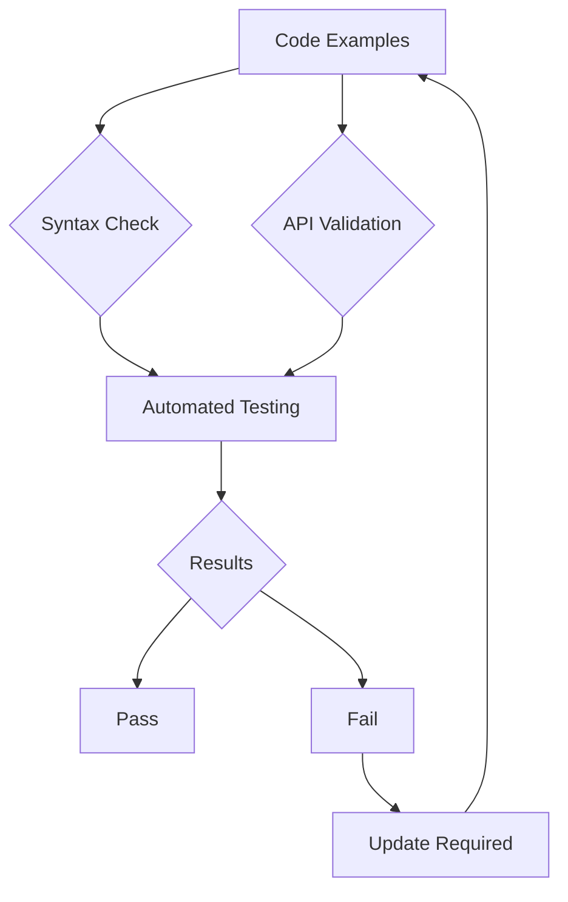

# Documentation Validation Procedures

## Overview
Comprehensive validation framework for ensuring documentation quality, accuracy, and completeness.

## Validation Workflows

### 1. Content Validation


### 2. Technical Validation


## Quality Assurance Procedures

### Documentation QA Process
1. **Automated Checks**
   ```python
   def run_qa_checks(content):
       results = {
           'style_check': check_style_compliance(content),
           'technical_check': validate_technical_content(content),
           'completeness': check_completeness(content),
           'cross_references': validate_references(content)
       }
       return results
   ```

2. **Manual Review**
   ```yaml
   review_checklist:
     technical_accuracy:
       - code_samples_verified
       - api_endpoints_tested
       - configuration_validated
     content_quality:
       - clarity_checked
       - completeness_verified
       - examples_tested
     user_experience:
       - navigation_tested
       - search_verified
       - accessibility_checked
   ```

## Verification Methods

### Content Verification
```python
def verify_content(documentation):
    checks = [
        verify_technical_accuracy(),
        verify_completeness(),
        verify_style_compliance(),
        verify_cross_references()
    ]
    return all(check.execute() for check in checks)
```

### Technical Verification
```python
def verify_technical_elements():
    verifications = {
        'code_samples': test_code_samples(),
        'api_endpoints': verify_api_documentation(),
        'configuration': validate_config_examples(),
        'commands': test_command_examples()
    }
    return all(verifications.values())
```

## Testing Protocols

### Automated Testing
```python
class DocumentationTester:
    def __init__(self):
        self.tests = load_test_suite()
        
    def run_tests(self):
        results = {
            'content_tests': self.test_content(),
            'technical_tests': self.test_technical_elements(),
            'integration_tests': self.test_integration()
        }
        return results
        
    def report_results(self, results):
        generate_test_report(results)
        notify_stakeholders(results)
```

### Manual Testing Procedures
```yaml
manual_test_procedures:
  user_journey_testing:
    steps:
      - follow_getting_started_guide
      - complete_basic_tasks
      - attempt_advanced_features
    validation_points:
      - clarity_of_instructions
      - completeness_of_information
      - accuracy_of_steps
```

## Accuracy Checks

### Technical Accuracy
```python
def check_technical_accuracy():
    return {
        'code_validation': validate_code_samples(),
        'api_accuracy': verify_api_documentation(),
        'configuration_accuracy': verify_configurations(),
        'command_accuracy': verify_command_examples()
    }
```

### Content Accuracy
```python
def verify_content_accuracy():
    return {
        'factual_accuracy': check_facts(),
        'procedure_accuracy': verify_procedures(),
        'reference_accuracy': verify_references(),
        'version_accuracy': check_version_information()
    }
```

## Validation Tools

### Automated Validators
```bash
# Run comprehensive validation
doc-validator validate \
  --content-path ./docs \
  --checks all \
  --report-format detailed
```

### Custom Validation Rules
```yaml
validation_rules:
  content:
    - rule: no_broken_links
      severity: critical
    - rule: all_examples_tested
      severity: high
    - rule: style_guide_compliance
      severity: medium
  technical:
    - rule: code_samples_working
      severity: critical
    - rule: api_docs_accurate
      severity: critical
    - rule: config_examples_valid
      severity: high
```

## Integration Tests

### Documentation Integration
```python
def test_documentation_integration():
    tests = [
        test_cross_references(),
        test_link_validity(),
        test_api_integration(),
        test_code_integration()
    ]
    return all(test.execute() for test in tests)
```

### System Integration
```python
def verify_system_integration():
    checks = {
        'platform_integration': check_platform_integration(),
        'tool_integration': verify_tool_integration(),
        'ci_cd_integration': test_ci_cd_pipeline(),
        'monitoring_integration': verify_monitoring()
    }
    return all(checks.values())
```

## Related Documentation
- [Metrics Framework](./METRICS_FRAMEWORK.md)
- [Assessment Tools](./ASSESSMENT_TOOLS.md)
- [Scoring System](./SCORING_SYSTEM.md)
- [Coverage Analysis](./COVERAGE_ANALYSIS.md)

